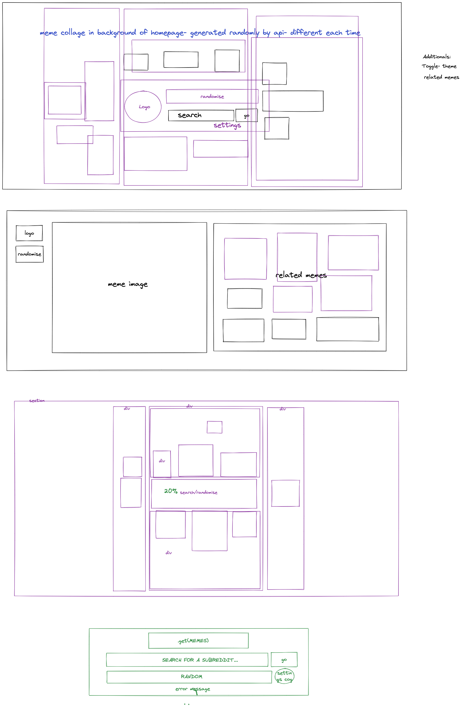
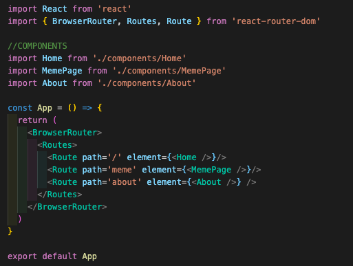
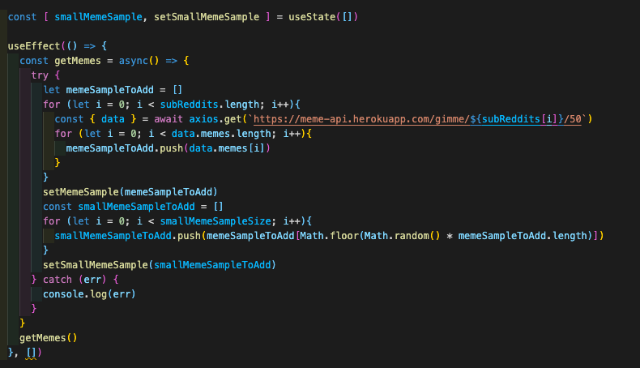
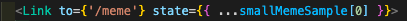
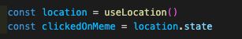
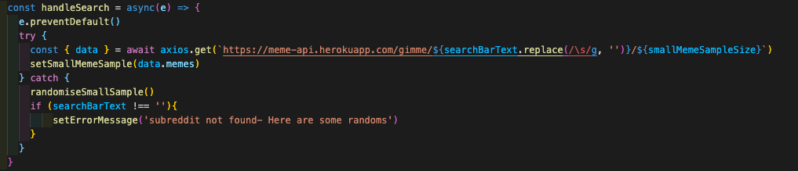

# GA PROJECT 2- GETMEMES

## [OPEN IN BROWSER](https://getmeme.netlify.app/)

## BRIEF

This two day assignment was to, in a pair, create a front-end React App using a public API. As well as getting to showcase our newly learnt React and framework knowledge, this was a great project to get familiar with pair-coding, in which we agreed upon a shared vision and utilised each of our strengths and skills to realise that vision.

My main contributions to this project was mainly functionality in the form of page navigation, handling API requests and working with the data.

My newly learnt technologies for this project were SASS and React.

Made in Collaboration with [Tom Murphy](https://github.com/TMurp).

This app takes data from the following API developed by [Dev Daksan](https://github.com/D3vd): https://github.com/D3vd/Meme_Api

## TIMEFRAME

2 Days

## TECHNOLOGIES
* JavaScript
* HTML
* CSS
* SASS
* React

## OUTLINE
GetMemes is simply a meme browser where you can look at randomised memes pulled from a collection of 15 different popular subreddits. These are displayed on our homepage in a collage surrounding our central control bar. In the central control bar you can:
* Randomise the collage (still from the 15 preset subreddits). You can do this with the randomise button or by clicking the .get(Memes) logo. 
* Set the collage to consist of memes from a specific subreddit of your choosing. Simply type the name of the subreddit into the search bar and click the .get(Memes) logo.

Furthermore you can click on any of the memes on the homepage to bring you to a larger image of that meme alongside suggested memes from the same subreddit.  

## PLANNING
Using the API Client, Insomnia was very useful for the planning stage of this project. Because we had to choose our own API and only had 2 days to complete this project, we both agreed that finding a simple API with a good data structure was the best way to go and Insomnia was useful for reviewing the data and experimenting with the API requests before commiting to a specific API. 

We both agreed that we wanted to lean towards a nice design rather than trying to push too much functionality. For this we agreed that an image based API would be ideal and soon we landed on the concept of a meme browser.

We then spent some time searching for a good meme based API before we arrived at Dev Deskan's public Meme API detailed above. The reason we decided to run with this API in the end was because the data was structured in a very simple way, there was good documentation for requesting different data pools and that the nature of this API, in that it scraps from Reddit itself, meant that we would have lots of flexibility in choosing different subreddits to customise our app as much as we wanted.  

Once we had decided on an API and general concept, we brainstormed design ideas and recounted a [site](https://www.inprnt.com/discover/) we had both previously seen with an interesting collage design that then offered the main inspiration for the design of our app. We then took to Excalidraw to wireframe a rough design as well as sketching the HTML breakdown and discussing how to code the collage look we wanted to achieve. 

Tom and I pair-coded together initially to set up the react app and code the basic HTML of the homepage, however to achieve everything that we wanted to in the short timeframe we agreed that once I had coded the initial HTML of each section, Tom would then move on to the styling while I worked on the functionality. 

## REACT
This being the first project we have done using a framework, it was exciting to see the basic capabilities of what React allows us to do and what is made much easier by implementing a framework.  

To set up our React app we used the CRA package. This was daunting to use at first because this was also our introduction to installing packages into our projects as well as seeing for the first time files like package.json and the general set up of a framework which felt like a big step up from your Vanilla .js, .css & .html files. The duration of this project was a great opportunity to become more familiar with these files and understand the purpose of them and what they are used for.    

A major part of React is that it is component-based. This was exciting to learn about as we began to implement it in our code. We built 3 main components in this project that formulated the 3 different pages you can navigate to. Additionally we made a separate component for the centre bar situated in the homepage. The reason we separated this out into a different component was to keep it independent of the collage and make it easily accessible in our code. We also separated the spinner component which was used on both the homepage and the meme page. To make our code further follow the DRY principle, we could have also created a meme component for each meme card in the collage and on the meme page.

Additionally an important concept of React is using the React Router DOM to navigate to different parts of the site. 

Another great concept of React are the hooks which are great to learn about and prove to be extremely useful. The most common ones we used in this project are useState and useEffect. On our homepage we defined a piece of state as smallMemeSample and set it to an empty array. In our JSX code the smallMemeSample is what is mapped through to create the HTML for the meme collage. Using the useEffect hook which is set to run on page load, we run a request to the API and then set some of that data to the state of smallMemeSample. React then recognises this change of state and re-renders the page which means that now, instead of the JSX code mapping through an empty array it now maps through our newly set array of meme data.   

One challenging aspect of the API we chose was that on each request the memes are randomly pulled and there is no way of requesting a specific meme or collection of specific memes. Typically until now we had used the hook useParams in which the id of the meme would be passed through in the route path. So for instance if the meme had an id of '1' the path would look like 'memes/1'. useParams would then be able to take that id out of the URL and we could then code a new API request using that id to retrieve that specific meme. As this was not an option in this case a challenge for us was therefore to find a way to pass the meme you clicked on on the homepage to the meme page. One solution to this problem was to store the meme data in the browser's local storage however this felt like a misuse of local storage. I discovered that a way to do this is to include a state prop on the link tag which then passes through to the new page you're navigated to. On the new page the data passed through will be available on the location's state property which you can then retrieve by using the hook useLocation.   

## AXIOS

This is also the first project I have completed that uses an API. This meant that I had the opportunity to learn more about the use of APIs in software development as well as specifically learning how front-end clients make requests to a database. It was also interesting reading through some of the public APIs' documentations before settling on the one we have used. 

The Meme API we used had various custom endpoints where you can specify which subreddit you wanted the memes to come from and also what size of sample you want to request (with a max of 50). We utilised both these customs in our application as seen below in the code where we use Axios to make the request to the end point. 

## CONCLUSION AND KEY LEARNING
I felt that React, as my first framework, definitely had a steep learning curve in order to get to grips with the general concept and being able to start applying the basic elements of the framework efficiently. However I am definitely much more comfortable using React now and I am very excited to implement it in many more projects and grow my React knowledge. I also feel that now I have learnt the basics of one framework, other frameworks will come a lot easier and so I'd love to try different frameworks in future projects too.    

This was also a great project to get to grips with APIs and understand their use in software development. It was particularly interesting reading through the documentation of the different APIs when looking for one to use as it was a good way to see how different people set up their data structures and endpoints.

Working with Tom was the first substantial bit of pair coding that I have done and I think we worked very well over the 2 days complimenting each others strengths and weaknesses. 

## FUTURE IMPROVEMENTS
As this project is more focused on design, it would be great to implement more finess to the site. For example to add animation on the hover effect of the meme cards or when you randomise the memes they shrink into nothing and grow back as new memes.

There are a few design faults which arise due to the dimensions of the images. For example if you get a particularly tall meme on the homepage it can run off the top or bottom of the page and on the meme page it squashes the image and can also hide the caption.

The data from the API provides different resolutions of the same meme however not on every data point. To keep it simple and so we get a good image, we chose to code a midrange resolution to show on the site. Most memes have this image however in some cases a meme will not show up and this is the reason why. To recreate this issue you can search the subreddit 'car' and you'll see that instead of receiving an error message, the collage disappears until you search another subreddit or randomise.     

#### KNOWN BUGS
On occasions certain requests will crash the site. To recreate the bug, search 'monkies'. 

## CONTACT
I would love to receive any feedback or hear about any of your similar projects. Please get in touch!

tonyhaunschmidt@gmail.com

[tonyhaunschmidt.com](https://www.tonyhaunschmidt.com/)

[LinkedIn/tonyhaunschmidt](https://www.linkedin.com/in/tony-haunschmidt/)

[My GitHub Profile and Other Projects](https://github.com/tonyhaunschmidt)
